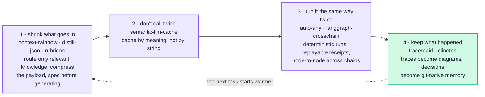
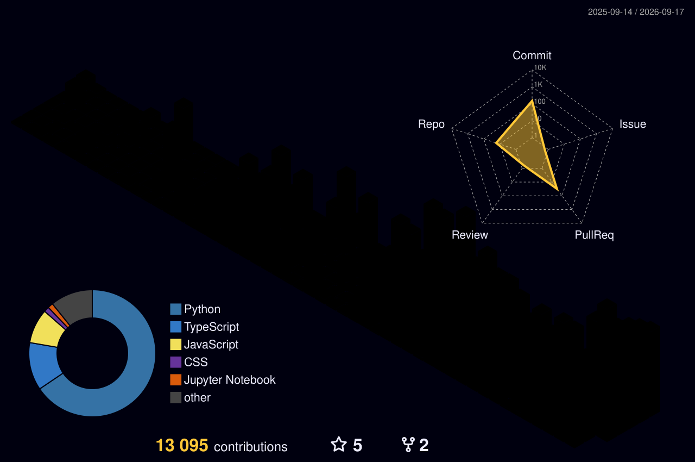

  

  
  
  
  
  

<h3 align="center">🧠 Eight packages. One thesis.</h3>

  <samp>An agent loop leaks tokens at every stage, and none of those stages is observable by default. 
  Each package below is one stage made cheap, or made visible — and they compose.</samp>

<samp>The dotted edge is the point — most agent stacks throw the run away; this one feeds it back.</samp>

<h3 align="center">📦 Published work</h3>

<b>🐍 PyPI — 8 packages · 18,796 downloads</b>

 

| Package | What it does | Version | Downloads |
|---|---|---|---|
| [**tracemaid**](https://pypi.org/project/tracemaid/) · [src](https://github.com/karthyick/tracemaid) | OpenTelemetry traces → Mermaid diagrams you can actually read |  | `4,442` |
| [**rubricon**](https://pypi.org/project/rubricon/) | Specification-first generation — write the rubric, *then* generate against it |  | `4,198` |
| [**distill-json**](https://pypi.org/project/distill-json/) · [src](https://github.com/karthyick/DISTILL) | Lossless JSON compression for LLM payloads — 60-85% token reduction, 6.6× ratio |  | `2,974` |
| [**semantic-llm-cache**](https://pypi.org/project/semantic-llm-cache/) · [src](https://github.com/karthyick/prompt-cache) | Cache by *meaning*, not by string — one decorator, 20-40% of calls never leave |  | `2,378` |
| [**clinotes**](https://pypi.org/project/clinotes/) · [src](https://github.com/karthyick/clinotes) | Git-native project memory for coding agents — decisions as Markdown, MCP-ready |  | `1,752` |
| [**auto-any**](https://pypi.org/project/auto-any/) | Browser and task automation that replays — every run is a signed receipt |  | `1,473` |
| [**langgraph-crosschain**](https://pypi.org/project/langgraph-crosschain/) · [src](https://github.com/karthyick/langgraph-crosschain) | Direct node-to-node communication across separate LangGraph chains |  | `1,093` |
| [**context-rainbow**](https://pypi.org/project/context-rainbow/) · [src](https://github.com/karthyick/context-rainbow) | Color-aware context routing — progressive knowledge loading, not bulk stuffing |  | `486` |

Eight releases between Nov 2025 and Aug 2026. Version badges are live; download totals are cumulative, refreshed from pypistats.

<b>🧩 VS Code Marketplace — 8 extensions · 5,078 installs</b>

 

| Extension | What it does | Installs |
|---|---|---|
| [**Python Venv Activator**](https://marketplace.visualstudio.com/items?itemName=krextensions.venv-activator) | Activates the right venv the moment you open the folder | `2,644` |
| [**Code to Flowchart**](https://marketplace.visualstudio.com/items?itemName=krextensions.code-to-flowchart) | Turns the function under your cursor into an interactive flowchart | `2,243` |
| [Code2Summarize](https://marketplace.visualstudio.com/items?itemName=krextensions.code2summarize) · [Code2PR](https://marketplace.visualstudio.com/items?itemName=krextensions.code2pr) · [Code2Assist](https://marketplace.visualstudio.com/items?itemName=krextensions.code2assist) · [Folder Structure Creator](https://marketplace.visualstudio.com/items?itemName=krextensions.folder-structure-creator) · [Shared Venv Activator](https://marketplace.visualstudio.com/items?itemName=krextensions.shared-venv-activator) · [Package to Flowchart](https://marketplace.visualstudio.com/items?itemName=krextensions.package-to-flowchart) | Six smaller editor tools | `191` |

<b>🔬 Research & models</b>

 

**[Evaluation-First Attention](https://github.com/karthyick/evaluation-first-attention)** — specification-driven generation
via dynamic rubric conditioning and failure-weighted reattention. Instead of generating and then scoring, the rubric is
produced first and conditions the generation itself. `rubricon` is the reference implementation.

**[llm_tinystories](https://github.com/karthyick/llm_tinystories)** — a 24.5M-parameter Transformer trained from scratch:
custom 10K-vocab tokenizer, 8.65 perplexity, 100% article-generation accuracy. Trained locally on an RTX 5090 — the point
was proving how far a *small* model gets on a well-shaped domain.

**Domain SLM distillation** — compressing large general models into small domain-specific ones. Same thesis as the
packages: get the same answer for less.

<h3 align="center">🛠️ Stack</h3>

<b>AI / ML</b>

  

<b>Backend · Data · Cloud</b>

  

<b>Frontend · Tooling</b>

  

  
  
  
  
  
  
  
  
  
  

Certified: Azure AZ-900 · AI-900 · DP-900 · PL-900 · Executive PG in AI &amp; ML

<h3 align="center">📊 By the numbers</h3>

  
  

<h3 align="center">🐍 Watch the snake eat my contributions</h3>

  <picture>
    <source media="(prefers-color-scheme: dark)" srcset="https://raw.githubusercontent.com/karthyick/karthyick/output/github-snake-dark.svg"/>
    <source media="(prefers-color-scheme: light)" srcset="https://raw.githubusercontent.com/karthyick/karthyick/output/github-snake.svg"/>
    
  </picture>

<h3 align="center">🏙️ A year of commits, in 3D</h3>

  

<h3 align="center">📫 Find me</h3>

  
  
  
  

  <samp>📍 Chennai, India · Lead AI/ML Engineer @ Appian 
  <a href="https://aichargeworks.com">aichargeworks.com</a> is my R&amp;D lab — everything above gets tried there first.</samp>

  <samp>Happy to talk about agent reliability, token economics, small-model training, or anything above that you think is wrong.</samp>

