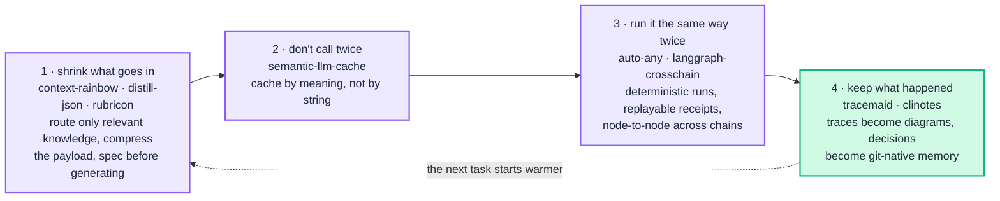

<h1 align="center">Karthick Raja M</h1>

  <em>I build the unglamorous layer that makes LLM systems cheap to run, easy to inspect, and identical on the second run.</em>

  
  
  

---

## The through-line

Eight packages, one problem. An agent loop leaks tokens at every stage, and none of
those stages is observable by default. Each package below is one stage made cheap or
made visible — and they compose:

The dotted edge is the point. Most agent stacks throw the run away; this one feeds it
back, so the next task starts with what the last one learned.

---

## 🐍 PyPI — 8 packages · 18,796 downloads

| Package | What it does | Version | Downloads |
|---|---|---|---|
| [**tracemaid**](https://pypi.org/project/tracemaid/) · [src](https://github.com/karthyick/tracemaid) | OpenTelemetry traces → Mermaid diagrams you can actually read |  | 4,442 |
| [**rubricon**](https://pypi.org/project/rubricon/) | Specification-first generation — write the rubric, *then* generate against it |  | 4,198 |
| [**distill-json**](https://pypi.org/project/distill-json/) · [src](https://github.com/karthyick/DISTILL) | Lossless JSON compression for LLM payloads — 60-85% token reduction, 6.6× ratio |  | 2,974 |
| [**semantic-llm-cache**](https://pypi.org/project/semantic-llm-cache/) · [src](https://github.com/karthyick/prompt-cache) | Cache by *meaning*, not by string — one decorator, 20-40% of calls never leave |  | 2,378 |
| [**clinotes**](https://pypi.org/project/clinotes/) · [src](https://github.com/karthyick/clinotes) | Git-native project memory for coding agents — decisions as Markdown, MCP-ready |  | 1,752 |
| [**auto-any**](https://pypi.org/project/auto-any/) | Browser and task automation that replays — every run is a signed receipt |  | 1,473 |
| [**langgraph-crosschain**](https://pypi.org/project/langgraph-crosschain/) · [src](https://github.com/karthyick/langgraph-crosschain) | Direct node-to-node communication across separate LangGraph chains |  | 1,093 |
| [**context-rainbow**](https://pypi.org/project/context-rainbow/) · [src](https://github.com/karthyick/context-rainbow) | Color-aware context routing — progressive knowledge loading, not bulk stuffing |  | 486 |

Eight releases between Nov 2025 and Aug 2026. Version badges are live; download
totals are cumulative, refreshed from pypistats.

## 🧩 VS Code — 8 extensions · 5,078 installs

| Extension | What it does | Installs |
|---|---|---|
| [**Python Venv Activator**](https://marketplace.visualstudio.com/items?itemName=krextensions.venv-activator) | Activates the right venv the moment you open the folder | 2,644 |
| [**Code to Flowchart**](https://marketplace.visualstudio.com/items?itemName=krextensions.code-to-flowchart) | Turns the function under your cursor into an interactive flowchart | 2,243 |
| [Code2Summarize](https://marketplace.visualstudio.com/items?itemName=krextensions.code2summarize) · [Code2PR](https://marketplace.visualstudio.com/items?itemName=krextensions.code2pr) · [Code2Assist](https://marketplace.visualstudio.com/items?itemName=krextensions.code2assist) · [Folder Structure Creator](https://marketplace.visualstudio.com/items?itemName=krextensions.folder-structure-creator) · [Shared Venv Activator](https://marketplace.visualstudio.com/items?itemName=krextensions.shared-venv-activator) · [Package to Flowchart](https://marketplace.visualstudio.com/items?itemName=krextensions.package-to-flowchart) | Six smaller editor tools | 191 |

---

## 🔬 Research & models

**[Evaluation-First Attention](https://github.com/karthyick/evaluation-first-attention)** — specification-driven
generation via dynamic rubric conditioning and failure-weighted reattention. Instead of generating
and then scoring, the rubric is produced first and conditions the generation itself.
`rubricon` above is the reference implementation.

**[llm_tinystories](https://github.com/karthyick/llm_tinystories)** — a 24.5M-parameter Transformer trained
from scratch: custom 10K-vocab tokenizer, 8.65 perplexity, 100% article-generation accuracy.
Trained locally on an RTX 5090 (32GB) — the whole point was proving how far a *small* model gets
on a well-shaped domain.

**Domain SLM distillation** — compressing large general models into small domain-specific ones,
which is the same thesis as the packages: get the same answer for less.

---

## 🛠️ What I actually reach for

| | |
|---|---|
| **LLM / agents** | PyTorch · Transformers · PEFT (LoRA, QLoRA) · LangChain · LangGraph · MCP · Ollama |
| **Models** | Claude (Opus / Sonnet) · GPT · Llama · Qwen · DeepSeek · Mistral · Phi |
| **Retrieval** | FAISS · pgvector · ChromaDB · Pinecone · hybrid + rerank |
| **Serving** | FastAPI · Docker · Azure (AI Services, Functions, AKS, Cosmos) · AWS (SageMaker, Lambda) |
| **Data / apps** | PostgreSQL · SQL Server · DuckDB · Redis · React · TypeScript · Tailwind |
| **Ops** | GitHub Actions · MLflow · Weights & Biases · OpenTelemetry |

Certified: Azure AZ-900 · AI-900 · DP-900 · PL-900 · Executive PG in AI & ML.

---

## 📈 Activity

  

  
  
  

---

## 📫 Elsewhere

[Portfolio](https://karthyick.github.io) · [LinkedIn](https://www.linkedin.com/in/karthick-raja-mohan-753431123/) · [karthickrajam18@gmail.com](mailto:karthickrajam18@gmail.com) · [aichargeworks.com](https://aichargeworks.com) — my R&D lab, where all of the above gets tried first

📍 Chennai, India · Lead AI/ML Engineer @ Appian

Happy to talk about agent reliability, token economics, small-model training, or anything above
that you think is wrong.
